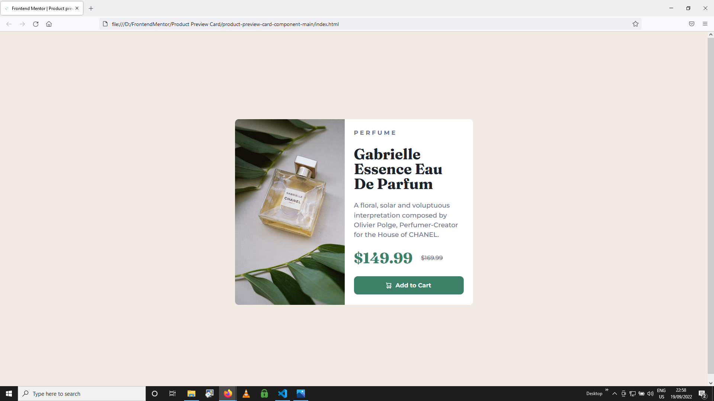
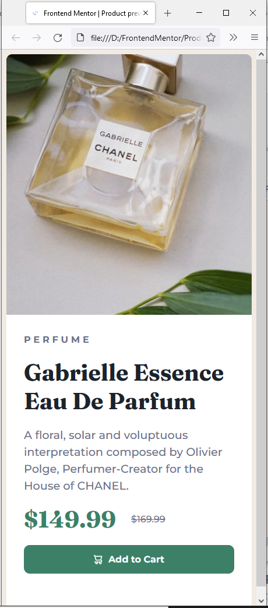

# Frontend Mentor - Product preview card component solution

This is a solution to the [Product preview card component challenge on Frontend Mentor](https://www.frontendmentor.io/challenges/product-preview-card-component-GO7UmttRfa). Frontend Mentor challenges help you improve your coding skills by building realistic projects. 

## Table of contents

- [Overview](#overview)
  - [The challenge](#the-challenge)
  - [Screenshot](#screenshot)
  - [Links](#links)
- [My process](#my-process)
  - [Built with](#built-with)
  - [What I learned](#what-i-learned)
  - [Continued development](#continued-development)
  - [Useful resources](#useful-resources)
- [Author](#author)

**Note: Delete this note and update the table of contents based on what sections you keep.**

## Overview

### The challenge

Users should be able to:

- View the optimal layout depending on their device's screen size
- See hover and focus states for interactive elements

### Screenshot




### Links

- Solution URL: [Add solution URL here](https://your-solution-url.com)
- Live Site URL: [Add live site URL here](https://your-live-site-url.com)

## My process

Step 1 - Jump in head first.

Step 2 - Realise I missed the planning phase and my 2 year old can design and plan things better than me.

Step 3 - Steal my 2 year old's crayons and paper to start the design from beginning. 

Step 4 - Think about CSS I will need to use - refresh and research.

Step 5 - Begin coding.

Step 6 - Throw laptop out of the house in frustration.

Step 7 - Realise it was my mistake for missing an ';' and apologise to laptop and have another attempt.

Step 8 - Celebratory dance of completion. 

### Built with

- HTML5
- CSS
- VS Code
- Sugar
- Caffeine
- Anger mis-management
- Tender Loving Care

### What I learned

',' '.' ';' ':' '!' - all begin to look the same after midnight. 

Flex is your friend - get inside of flex to get the results. 

If something isn't working, isolate the part you want to create - make it work and then add back into your project ready to encounter the next set of issues. 

The code below was required to center the preview card in the web page for the desktop view. I tried several times to make the changes elsewhere in the code but it finally worked in the body.

I was having issues with a container not behaving like it was meant to. I used the inspect and select element to identify the troublesome container and then adjust the values live to make sure it worked and then ammended the code to work. 

```css
body {
    height: 100vh;
    width: 100vw;
    display: flex;
    align-items: center;
    justify-content: center;
}
```

### Continued development

Better planning, more practice, more learning. 

### Useful resources

- [MDN Web Docs](https://developer.mozilla.org/en-US/) - Invaluable.
- [Stack Overflow](https://stackoverflow.com/) - Somebody somewhere at some point in time has been banging their head at the same or a similar issue to you.

## Author

- Frontend Mentor - [@iklmonkey](https://www.frontendmentor.io/profile/iklmonkey)
